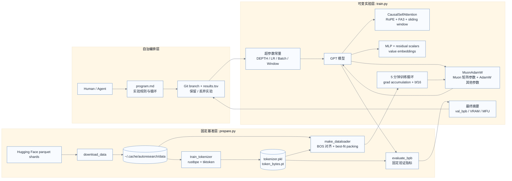
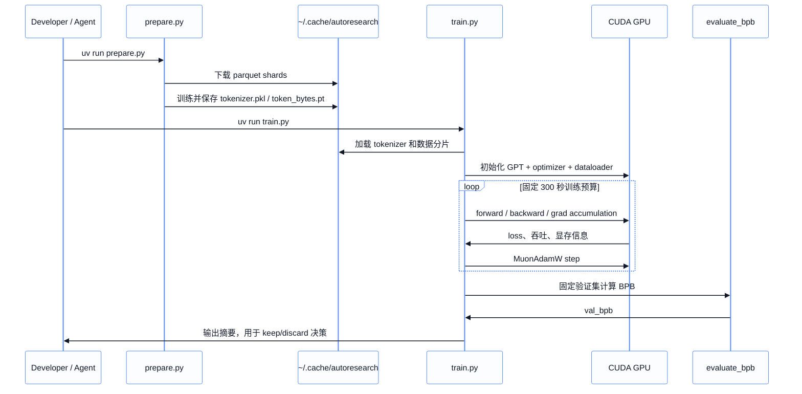

# autoresearch 架构与设计分析

## 项目定位

`autoresearch` 是一个面向自治预训练实验的极简研究系统。它把 LLM 预训练实验压缩成三个核心文件：`prepare.py` 固化数据、分词、加载与评估；`train.py` 承载模型、优化器和训练循环；`program.md` 约束 agent 的实验流程。核心目标不是构建通用训练框架，而是在固定 5 分钟训练预算和固定验证指标下，让 agent 快速尝试架构、超参数和优化策略，并用 `val_bpb` 判断是否保留改动。

## 仓库结构

```text
autoresearch/
├── prepare.py       # 数据下载、BPE tokenizer、dataloader、BPB 评估
├── train.py         # GPT 模型、MuonAdamW 优化器、训练主循环
├── program.md       # agent 实验协议与自治循环说明
├── analysis.ipynb   # 结果分析 notebook
├── progress.png     # README 展示图
├── pyproject.toml   # Python 依赖，使用 uv 管理
├── uv.lock          # 锁定依赖版本
└── read/
    └── architecture.md
```

运行时数据默认放在 `~/.cache/autoresearch/`，包括 parquet 数据分片、`tokenizer.pkl` 和 `token_bytes.pt`。实验日志与 `results.tsv` 被设计为本地非提交产物。

## 总体架构图



## 核心组件职责

### `prepare.py`: 固定基准与运行时工具

`prepare.py` 负责把外部数据变成可复现实验输入。`download_data()` 下载训练分片并固定最后一个 shard 作为验证集，避免实验过程“调验证集”。`train_tokenizer()` 使用 `rustbpe` 训练 8192 词表的 BPE tokenizer，再转换为 `tiktoken.Encoding`。`token_bytes.pt` 记录每个 token 的 UTF-8 byte 长度，用于计算 BPB。

运行时阶段，`Tokenizer`、`make_dataloader()` 和 `evaluate_bpb()` 被 `train.py` 直接导入。`make_dataloader()` 将文档以 BOS 开头打包到固定长度序列中，通过 best-fit packing 降低浪费，并用 pinned CPU buffer 到 GPU buffer 的方式减少拷贝开销。`evaluate_bpb()` 使用固定验证 shard、固定 `MAX_SEQ_LEN` 和固定 `EVAL_TOKENS`，保证不同实验可比较。

### `train.py`: 可变实验面

`train.py` 是主要实验载体。文件前半部分定义 GPT 结构：`GPTConfig`、`CausalSelfAttention`、`MLP`、`Block` 和 `GPT`。注意力模块使用 Flash Attention 3 kernel，并通过 `WINDOW_PATTERN` 在 full attention 与 sliding window attention 间切换。模型还包含 RoPE、RMSNorm、value embeddings、残差缩放参数和 soft-capped logits。

优化器部分实现 `MuonAdamW`：二维矩阵参数走 Muon 更新，embedding、lm head、value embeddings 和标量参数走 AdamW。这样把大矩阵的训练动力学与普通参数分开处理，属于性能和收敛质量导向的手写优化器设计。

脚本底部是训练主流程：加载 tokenizer，构造模型，初始化权重，配置 optimizer，创建 dataloader，然后在 `TIME_BUDGET = 300` 秒内训练。前 10 step 主要用于跳过编译和启动抖动，不计入稳定训练时间。结束后调用 `evaluate_bpb()` 输出 `val_bpb`、训练秒数、显存峰值、MFU、token 数和参数量。

### `program.md`: 自治实验协议

`program.md` 是 agent 的操作规约。它规定只修改 `train.py`，不修改 `prepare.py`，不新增依赖，不篡改评估函数。实验流程是：建分支、跑 baseline、修改 `train.py`、提交、运行训练、记录 `results.tsv`，如果 `val_bpb` 下降则保留，否则回退。这个文件把“研究组织方式”显式写成 Markdown，使 agent 能在受控边界内连续试验。

## 数据与训练流程



## 设计思路总结

这个项目的设计核心是“把变量压到最少，把实验面暴露清楚”。数据、tokenizer、验证集、评估指标和训练时长都被固定在 `prepare.py` 中，减少 benchmark 漂移；`train.py` 则故意保持单文件可编辑，降低 agent 理解和修改成本；`program.md` 定义自治实验协议，避免 agent 修改不该修改的基准部分。

它不是传统的可配置训练平台，没有复杂 CLI、配置系统、分布式抽象或插件机制。相反，它选择单 GPU、单模型文件、固定时间预算，用快速实验迭代换取研究速度。`val_bpb` 作为 bits-per-byte 指标，不依赖词表大小，适合比较 tokenizer 固定但模型结构变化的预训练实验。整体设计偏向“可控自治研究沙盒”，而不是“生产级训练框架”。

## 面试视角：可能问题与回答

### 1. 为什么把 `prepare.py` 设计成不可修改的固定层？

为了保证实验可比较。数据下载、验证集选择、dataloader 和 `evaluate_bpb()` 如果随实验一起变化，模型提升可能来自评估口径变化，而不是真正的训练改进。固定 `prepare.py` 等于固定 benchmark。

### 2. 为什么使用 `val_bpb` 而不是常见的 validation loss？

BPB 按字节归一化，能减少词表大小和 tokenization 粒度对指标的影响。它适合语言建模中跨 tokenizer 或跨架构比较，数值越低表示每个 byte 的预测不确定性越低。

### 3. 为什么训练时间固定为 5 分钟，而不是固定 step 或 token 数？

项目目标是让 agent 在真实硬件上寻找“单位时间内最有效”的改动。固定 step 会偏向更慢的大模型，固定 token 数会忽略吞吐差异；固定 wall-clock 训练预算能同时惩罚低效架构和低效实现。

### 4. `train.py` 为什么不拆成多个模块？

这是有意的局部性设计。agent 只需要读一个文件就能理解并修改模型、优化器和训练循环，diff 更集中，也减少跨模块重构带来的实验噪声。代价是文件较长，复用性弱。

### 5. MuonAdamW 的设计动机是什么？

它把参数分组：矩阵参数使用 Muon 做带正交化倾向的更新，embedding、lm head 和标量参数使用 AdamW。这样可以针对 Transformer 中不同参数形态使用不同优化动态，目标是提升短时间训练效率。

### 6. 为什么需要 pinned validation shard？

固定最后一个 shard 作为验证集，可以避免训练集和验证集混用，也让所有实验面对同一评估分布。否则 agent 可能通过数据切分变化得到不可比较的结果。

### 7. dataloader 的 best-fit packing 有什么价值？

它把多个文档打包进固定长度序列，尽量减少 padding 或空位，并保证每行以 BOS 对齐。这样提高 token 利用率，使固定 5 分钟预算内训练尽量多的有效 token。

### 8. 这个项目最大的工程风险是什么？

第一是硬件耦合强，默认依赖 CUDA、bf16 和 Flash Attention 3；第二是缺少单元测试，很多错误只能通过训练运行暴露；第三是 agent 可能过拟合 `val_bpb` 或引入复杂但收益很小的改动。

### 9. 如果要把它扩展成团队可用系统，优先改哪里？

优先加入实验记录规范、自动结果解析、最小 smoke tests、配置快照和硬件环境记录。之后再考虑多 GPU、更多数据集或更强的分析 dashboard。不要一开始就引入大型框架，否则会破坏当前项目的快速迭代优势。

### 10. 如何判断一次实验是否值得保留？

主要看 `val_bpb` 是否下降，同时参考显存、MFU、总 token 数和代码复杂度。如果收益极小但复杂度显著增加，应谨慎保留；如果简化代码且指标持平或更好，则很值得保留。
